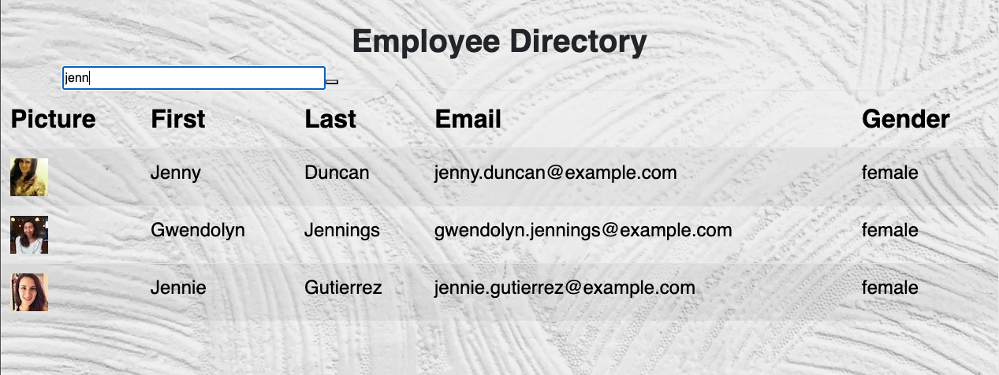

# Employee Directory

# Table of Contents  

* [Discription](#discription)
* [Screenshot](#screenshot)   
* [Contacts](#contacts)
* [Programming-Language](#programming-language)

## Discription   

This is a react application that allow users to view entire employee directory at once, filter and sort through them. This will prevent other employee/manager from being able to view non-sensitive data about other employees.

## Screenshot

 
## Contacts Info

Please reach out to me if you have any questions.

Email: afam262@gmail.com

Github Username: Afam-26

[Github link](https://github.com/Afam-26/employee-directory.git) 

[Click here for my Portfolio](https://afam-26.github.io/)

## Programming-Language 
\`\`\`

    React    

    MongoDB Atlas

    Axios

    Heroku
\`\`\`